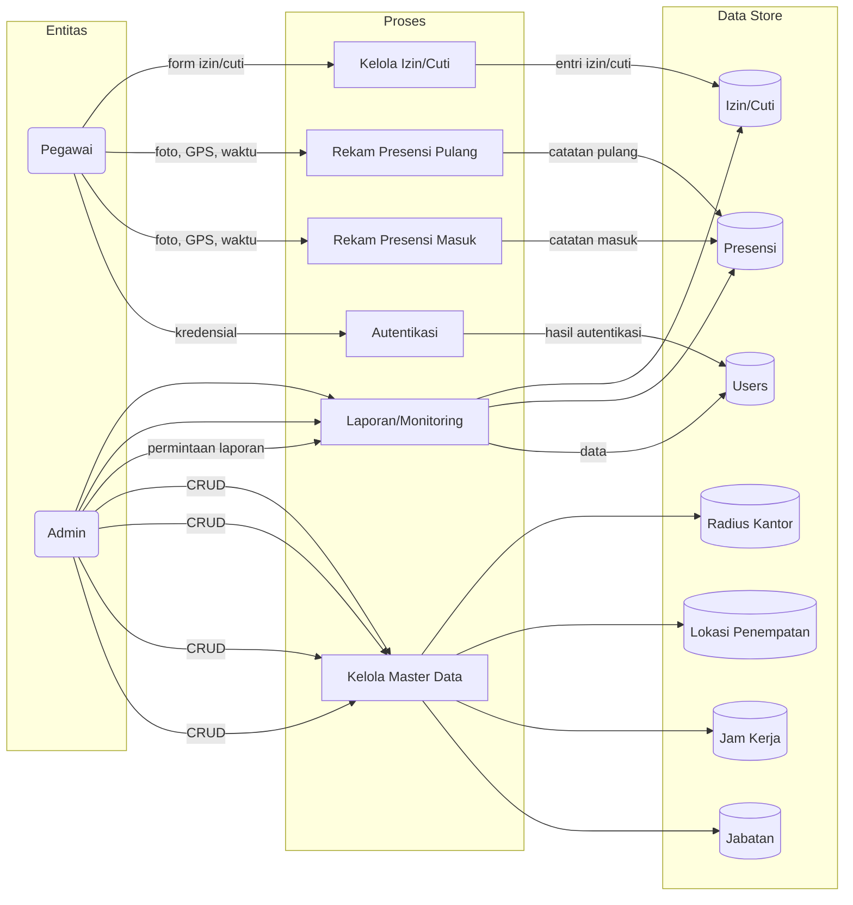
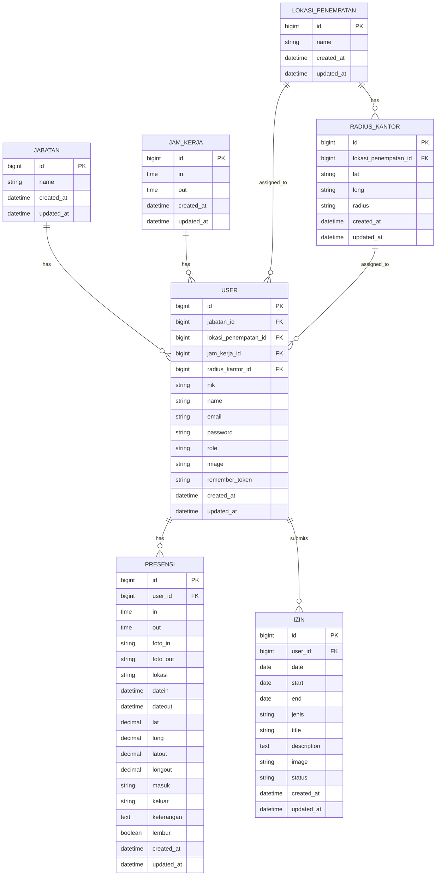

# Arsitektur Sistem Absensi Tenaga Kependidikan

Dokumen ini merangkum diagram Flowchart, DFD, ERD, dan desain konseptual database berdasarkan struktur kode dan migrasi di proyek saat ini.

## Ringkasan Fitur
- Autentikasi pegawai dan admin.
- Absensi masuk/pulang berbasis foto dan lokasi (radius kantor) dengan validasi jam kerja, keterlambatan, dan lembur.
- Histori presensi pegawai.
- Pengajuan dan pengelolaan Izin/Cuti.
- Master data: Jabatan, Jam Kerja, Lokasi Penempatan, Radius Kantor.
- Monitoring dan persetujuan (admin).

## Flowchart Absensi
```mermaid
flowchart TD
  A[Pegawai login] -->|valid| B[Dashboard Pegawai]
  A -->|invalid| A

  B --> C{Sudah absen masuk hari ini?}
  C -- Tidak --> D[Ambil foto + GPS]
  D --> E[Hitung jarak ke radius kantor]
  E --> F{Dalam radius?}
  F -- Tidak --> X[Ditolak: di luar radius]
  F -- Ya --> G[Bandingkan jam sekarang vs jam_kerja.in]
  G --> H{Terlambat?}
  H -- Ya --> I[Status: Terlambat]
  H -- Tidak --> J[Status: Masuk]
  I --> K[Simpan presensi masuk (in, foto_in, lat/long, datein, keterangan)]
  J --> K
  K --> L[Sukses]

  B --> M{Akan absen pulang?}
  M -- Ya --> N[Ambil foto + GPS]
  N --> O[Validasi jam >= jam_kerja.out]
  O -- Tidak --> Y[Belum waktunya pulang]
  O -- Ya --> P[Hitung jarak ke radius kantor]
  P --> Q{Dalam radius?}
  Q -- Tidak --> Z[Ditolak: di luar radius]
  Q -- Ya --> R[Set out, foto_out, dateout, latout/longout]
  R --> S{Jam > out?}
  S -- Ya --> T[lembur = 1]
  S -- Tidak --> U[lembur = 0]
  T --> V[Simpan presensi pulang]
  U --> V
  V --> W[Sukses]
```

## DFD Level 0


## ERD (Konseptual — Diselaraskan)


## Desain Konseptual Database (Tipe phpMyAdmin)
- users
  - id BIGINT UNSIGNED PK, AI
  - jabatan_id BIGINT UNSIGNED FK NULL
  - lokasi_penempatan_id BIGINT UNSIGNED FK NULL
  - jam_kerja_id BIGINT UNSIGNED FK NULL
  - radius_kantor_id BIGINT UNSIGNED FK NULL
  - nik VARCHAR(20) NULL
  - name VARCHAR(255) NOT NULL
  - email VARCHAR(255) UNIQUE NOT NULL
  - password VARCHAR(255) NOT NULL
  - role VARCHAR(50) NOT NULL
  - image VARCHAR(255) NULL
  - remember_token VARCHAR(100) NULL
  - created_at TIMESTAMP NULL
  - updated_at TIMESTAMP NULL
- jabatans
  - id BIGINT UNSIGNED PK, AI
  - name VARCHAR(100) NOT NULL
  - created_at TIMESTAMP NULL
  - updated_at TIMESTAMP NULL
- jam_kerjas
  - id BIGINT UNSIGNED PK, AI
  - in TIME NOT NULL
  - out TIME NOT NULL
  - created_at TIMESTAMP NULL
  - updated_at TIMESTAMP NULL
- lokasi_penempatans
  - id BIGINT UNSIGNED PK, AI
  - name VARCHAR(100) NOT NULL
  - created_at TIMESTAMP NULL
  - updated_at TIMESTAMP NULL
- radius_kantors
  - id BIGINT UNSIGNED PK, AI
  - lokasi_penempatan_id BIGINT UNSIGNED FK NULL
  - lat DECIMAL(10,7) NOT NULL
  - long DECIMAL(10,7) NOT NULL
  - radius INT UNSIGNED NOT NULL
  - created_at TIMESTAMP NULL
  - updated_at TIMESTAMP NULL
- presensis
  - id BIGINT UNSIGNED PK, AI
  - user_id BIGINT UNSIGNED FK NOT NULL
  - in TIME NULL
  - out TIME NULL
  - foto_in VARCHAR(255) NULL
  - foto_out VARCHAR(255) NULL
  - lokasi VARCHAR(255) NULL
  - datein DATETIME NULL
  - dateout DATETIME NULL
  - lat DECIMAL(10,7) NULL
  - long DECIMAL(10,7) NULL
  - latout DECIMAL(10,7) NULL
  - longout DECIMAL(10,7) NULL
  - masuk VARCHAR(20) NULL
  - keluar VARCHAR(20) NULL
  - keterangan TEXT NULL
  - lembur TINYINT(1) DEFAULT 0
  - created_at TIMESTAMP NULL
  - updated_at TIMESTAMP NULL
- izins
  - id BIGINT UNSIGNED PK, AI
  - user_id BIGINT UNSIGNED FK NOT NULL
  - date DATE NULL
  - start DATE NULL
  - end DATE NULL
  - jenis VARCHAR(20) NOT NULL
  - title VARCHAR(150) NULL
  - description TEXT NOT NULL
  - image VARCHAR(255) NULL
  - status VARCHAR(20) DEFAULT 'Pending'
  - created_at TIMESTAMP NULL
  - updated_at TIMESTAMP NULL

Catatan keselarasan vs migrasi saat ini:
- users: kolom radius_kantor_id dan image dipakai di controller namun belum ada di migrasi.
- presensis: datein, dateout, lat, long, latout, longout, masuk, keluar, keterangan, lembur dipakai di controller namun belum ada di migrasi.
- izins: date, start, end, image, status dipakai di controller/view namun belum ada di migrasi; sedangkan kolom title ada di migrasi namun tidak selalu diisi.

Rekomendasi migrasi penyesuaian (garis besar):
- Tambah users.radius_kantor_id (nullable), users.image (nullable string).
- Tambah kolom-kolom presensis di atas sebagai nullable, boolean lembur default 0.
- Tambah izins.date, start, end (nullable date), image (nullable string), status (string default 'Pending'); pertahankan title sebagai opsional.
  - id PK, user_id FK, date, start, end, jenis, title, description, status, timestamps

## Delta Terhadap Migrasi Saat Ini (Rekomendasi)
- Tabel `users` (database/migrations/2014_10_12_000000_create_users_table.php)
  - Tambah kolom: `radius_kantor_id` (FK ke `radius_kantors`), `image` (nullable string).
- Tabel `radius_kantors` (database/migrations/2024_09_21_140817_create_radius_kantors_table.php)
  - Tambah kolom: `lokasi_penempatan_id` (FK ke `lokasi_penempatans`).
  - Pertimbangkan tipe data: `lat`, `long` sebaiknya `decimal(10,7)`, `radius` `integer`.
- Tabel `presensis` (database/migrations/2024_09_19_122008_create_presensis_table.php)
  - Tambah kolom: `datein`, `dateout` (datetime), `lat`, `long`, `latout`, `longout` (decimal), `masuk`, `keluar` (string), `keterangan` (text), `lembur` (boolean default 0).
- Tabel `izins` (database/migrations/2024_09_22_193525_create_izins_table.php)
  - Tambah kolom: `date`, `start`, `end` (date), `status` (string). Pastikan kolom `title` sesuai kebutuhan.

Jika diinginkan, saya bisa menambahkan migrasi baru untuk perubahan di atas dan menyesuaikan tipe data agar perhitungan geolokasi lebih presisi.

---
Catatan: Diagram Mermaid dapat dilihat di editor Markdown yang mendukung Mermaid (mis. VS Code dengan ekstensi Markdown Preview Mermaid atau GitLab/GitHub yang mendukung rendering tertentu).

## Panduan Fitur & Langkah Penggunaan

Ringkasan ini menjelaskan fitur utama sistem dan langkah-langkah penggunaannya berdasarkan implementasi saat ini (routes, controller, dan view) tanpa kode.

### Peran & Modul
- Pegawai
  - Dashboard harian (status absen masuk/pulang, ringkas izin/sakit)
  - Absen Masuk/Pulang berbasis selfie + GPS dalam radius kantor
  - Histori Absensi (masuk/pulang)
  - Pengajuan Izin/Sakit (lampiran gambar opsional)
  - Pengajuan Cuti (rentang tanggal)
  - Profil (ubah data diri, password, jabatan, jam kerja, radius kantor, foto)
- Admin
  - Dashboard (statistik pegawai, cuti, izin, sakit; daftar hadir hari ini)
  - Master Data: Jabatan, Jam Kerja, Lokasi Penempatan, Radius Kantor
  - Persetujuan Izin/Sakit dan Cuti (approve/reject)
  - Data Pegawai (daftar + detail)
  - Monitoring Absensi (filter rentang tanggal, detail masuk/pulang)

### Alur Penggunaan Pegawai
1) Registrasi
   - Akses `home/register` dan isi: NIK, nama, email, password, pilih Jabatan, Jam Kerja, dan Lokasi/Radius Kantor.
   - Data disimpan sebagai akun dengan peran Pegawai.
2) Login
   - Akses halaman beranda `home` lalu login menggunakan email/password.
3) Absen Masuk
   - Buka menu Absen.
   - Ambil foto (kamera) dan izinkan akses GPS.
   - Sistem memvalidasi:
     - Belum pernah absen masuk pada tanggal berjalan.
     - Berada dalam radius kantor (perhitungan Haversine terhadap `Radius Kantor`).
     - Status masuk: "Masuk" jika sebelum atau tepat jam `in`, "Terlambat" jika melewati jam `in`.
   - Catatan tersimpan: waktu `in`, foto, koordinat `lat/long`, `datein`, dan status `masuk`/`keterangan`.
4) Absen Pulang
   - Hanya dapat dilakukan jika:
     - Sudah ada absen masuk hari ini, dan
     - Waktu saat ini ≥ jam kerja `out` (jika belum waktunya, ditolak).
   - Ambil foto dan pastikan masih dalam radius kantor.
   - Catatan tersimpan: waktu `out`, foto, koordinat `latout/longout`, `dateout`, status `keluar = Pulang`.
   - Jika waktu pulang melewati `out`, dicatat `lembur = 1`.
5) Histori
   - Lihat riwayat Masuk dan Pulang pada menu Histori.
6) Izin/Sakit
   - Ajukan melalui menu Izin: pilih tanggal dan jenis (Izin/Sakit), deskripsi, dan opsional unggah bukti (gambar). Status awal "Pending" sampai diproses Admin.
7) Cuti
   - Ajukan melalui menu Cuti: isi tanggal mulai/akhir dan deskripsi. Status awal "Pending".
8) Profil
   - Perbarui NIK, nama, email, password (opsional), Jabatan, Jam Kerja, Radius Kantor, serta foto profil.

### Alur Penggunaan Admin
1) Login Admin
   - Akses `login` dan masuk menggunakan akun berperan Admin.
2) Dashboard
   - Lihat metrik: jumlah Pegawai, Cuti, Izin, Sakit; daftar hadir Masuk/Pulang hari ini.
3) Master Data
   - Jabatan: buat, edit, hapus.
   - Jam Kerja: set waktu `in`, `out`, (tersedia isian lembur). Digunakan untuk penentuan terlambat dan batas pulang/lembur.
   - Lokasi Penempatan: buat, edit, hapus.
   - Radius Kantor: hubungkan ke Lokasi Penempatan dan set `lat`, `long`, `radius` (meter). Dipakai validasi GPS Absen.
4) Persetujuan Izin dan Cuti
   - Tinjau daftar Izin/Sakit dan Cuti, lakukan Approve/Reject. Status akan memperbarui entri pegawai.
5) Data Pegawai
   - Lihat daftar dan detail pegawai (profil, relasi jabatan/jam kerja/radius).
6) Monitoring Absensi
   - Lihat daftar Absensi dengan filter rentang tanggal. Buka detail Masuk atau Pulang untuk melihat rincian waktu, foto, dan lokasi.

### Aturan Validasi Utama
- Absen Masuk
  - Satu kali per hari per pegawai; membutuhkan foto dan GPS dalam radius.
  - Status "Terlambat" jika waktu saat ini > jam kerja `in`.
- Absen Pulang
  - Hanya setelah absen masuk pada hari yang sama; ditolak jika waktu saat ini < jam kerja `out`.
  - Wajib dalam radius dan unggah foto.
  - Jika waktu saat ini > jam kerja `out`, ditandai `lembur = 1`.
- Izin/Sakit/Cuti
  - Status awal "Pending" hingga disetujui/ditolak Admin.
- Waktu Sistem
  - Mengacu pada waktu server; sesuaikan timezone pada konfigurasi agar akurat.

### Prasyarat Data agar Absen Berjalan
- Admin telah menambahkan:
  - Minimal satu entitas Jam Kerja.
  - Lokasi Penempatan dan Radius Kantor (koordinat + radius) yang dipilih saat registrasi Pegawai.
  - Jabatan yang relevan.
- Akun Pegawai memiliki `jam_kerja_id` dan `radius_kantor_id` terisi.

### Rute Utama (Ringkas)
- Pegawai (middleware `auth.check`):
  - `pegawai.home`, `pegawai.absen`, `pegawai.histori`, `pegawai.lokasi`, `pegawai.profile`
  - `pegawai.saveabsen` (Masuk), `pegawai.absenout` (Pulang)
  - Izin: `pegawai.izin`, `pegawai.createizin`, `pegawai.detailizin`, `pegawai.storeizin`
  - Cuti: `pegawai.cuti`, `pegawai.createcuti`, `pegawai.detailcuti`, `pegawai.storecuti`
- Admin (middleware `auth`):
  - Dashboard: `main.dashboard`
  - Jabatan: `main.jabatan` (+ create/edit/update/destroy)
  - Jam Kerja: `main.jamkerja` (+ create/edit/update/destroy)
  - Lokasi: `main.lokasi` (+ create/edit/update/destroy)
  - Radius: `main.radius` (+ create/edit/update/destroy)
  - Izin: `main.izin`, Approve/Reject (`main.approve`/`main.reject`)
  - Cuti: `main.cuti`, Approve/Reject (`main.approvecuti`/`main.rejectcuti`)
  - Pegawai: `main.pegawai`, `main.detailpegawai`
  - Absensi: `main.absen`, `main.detailAbsen`, `main.detailAbsenPulang`

### Catatan Operasional
- Foto absensi disimpan di storage publik (`storage/app/public/images`) dan diakses lewat symlink `public/storage`. Pastikan `php artisan storage:link` sudah dijalankan di lingkungan produksi.
- Validasi radius menggunakan formula Haversine berbasis koordinat kantor pada `Radius Kantor` dan koordinat perangkat saat absen.
